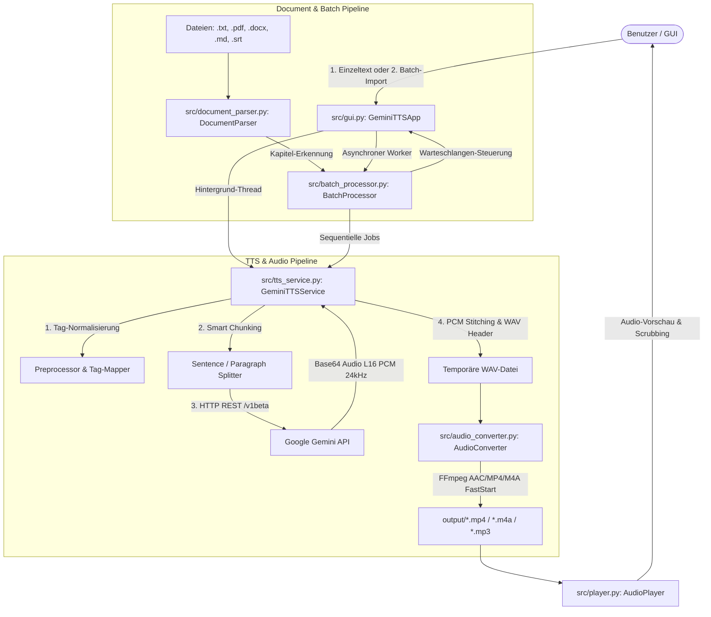

# System Architecture & Technical Specifications

Dieses Dokument beschreibt die Architektur, Datenflüsse und technischen Implementierungsdetails von **Gemini TTS Studio**. Es dient als umfassende Referenz für Entwickler und KI-Assistenten, die das Projekt warten oder erweitern.

---

## 1. Systemübersicht & Komponenten



---

## 2. Detaillierte Komponentenbeschreibung

### 2.1 Dokumenten-Parser (`src/document_parser.py`)
- **Unterstützte Formate**:
  - `.txt` / `.md`: Multi-Encoding-Leser (UTF-8, UTF-8-sig, CP1252, Latin-1).
  - `.pdf`: Extraktion aller lesbaren Seiten via `pypdf.PdfReader`.
  - `.docx`: Paragraph- & Tabellentext-Extraktion via `python-docx`.
  - `.srt`: Entfernt Untertitel-Sequenznummern und Timecodes für reine Sprachausgabe.
- **Kapitel-Splitting (`split_into_chapters`)**:
  - Erkennt Markdown-Überschriften (`# `, `## `, `### `) sowie strukturierte Textmarker (`Kapitel 1: ...`, `Chapter 2 ...`, `Teil 3 ...`).
  - Liefert durchnummerierte Kapitel-Tupel `[(Titel, Text), ...]`.

### 2.2 Batch- & Queue-Manager (`src/batch_processor.py`)
- Verwaltet die `BatchItem`-Warteschlange (ID, Quelldatei, Kapitel-Titel, Zeichen-/Wortanzahl, Status, Fortschritt, Ausgabepfad).
- Führt die Stapelgenerierung sequentiell im Hintergrund aus.
- Bietet Abbruch-Unterstützung (`cancel()`) und Fortschritts-Callbacks pro Aufgabe sowie für den gesamten Batch.

### 2.3 Backend & TTS Engine (`src/tts_service.py`)
- **API-Endpunkt**: `https://generativelanguage.googleapis.com/v1beta/models/{model}:generateContent?key={api_key}`
- **Modelle**:
  - `gemini-3.8-flash-tts` (Standard): Studio-Qualität & Flaggschiff-Modell.
  - `gemini-3.8-flash-lite-tts`: High-Speed & Massenverarbeitung.
  - `gemini-3.1-flash-tts-preview`: Bewährte Version.
  - `gemini-2.5-flash-preview-tts` (Automatischer Fallback): Robuste Fallback-Engine bei Streaming-Hiccups.
  - `gemini-2.5-pro-preview-tts`: Vorgänger Studio-Qualität.
- **Audio-Tags / Regieanweisungen**:
  - Inline-Tags (`[laugh]`, `[whisper]`, `[sad]`, `[excited]`, `[pause]`, `[sigh]`, `[slow]`, `[fast]`).
  - Deutsches Tag-Mapping (`TAG_REPLACEMENTS`) übersetzt `[lachen]` etc. automatisch.
- **Globale Regieanweisungen / System-Prompt (`[Tone: ...]`)**:
  - Da Google Gemini TTS Endpunkte `systemInstruction` mit 400 ablehnen, injiziert die Engine globale Sprechstilanweisungen automatisch als `[Tone: ...]` Direktive vor jeden Chunk. Dies wird vom Modell tonal umgesetzt, aber nicht vorgelesen.
- **Smart Chunking Engine**:
  - Teilt Texte an Absatz- und Satzgrenzen in Abschnitte (~300 Zeichen) auf, um Timeouts zu verhindern.
  - Nahtlose Verknüpfung der 16-Bit-PCM-Audioframes im Speicher.

### 2.4 Übersetzungs-Engine (`src/translation_service.py`)
- **Modell**: `gemini-3.8-flash`
- **Funktionsweise**: Übersetzt Texte blitzschnell in bis zu 32 Zielsprachen.
- **Tag-Erhalt**: Gewährleistet durch gezieltes Prompt-Engineering, dass alle eckigen Regieanweisungs-Tags (`[lachen]`, `[flüstern]`, `[Pause]`, etc.) an ihrer natürlichen grammatikalischen Position erhalten bleiben.
- **Modi**:
  - Einzeltext: Sofortübersetzung im Textfeld (`🌐 In Zielsprache übersetzen`) oder automatische Übersetzung vor Sprachsynthese.
  - Batch: Mehrsprachiger Export für mehrere ausgewählte Zielsprachen (`_de.mp4`, `_en.mp4`, `_es.mp4`, etc.).

### 2.5 Audio-Konvertierung & FFmpeg (`src/audio_converter.py`)
- **Zielprofil (Web-Streaming Standard)**:
  ```bash
  ffmpeg -i eingabe.wav -c:a aac -b:a 64k -ac 1 -ar 44100 -movflags +faststart ausgabe.mp4
  ```
  - **Codec**: `aac` (AAC-LC).
  - **Kanäle**: `1` (Mono).
  - **Bitrate**: `64k` (64 kbit/s).
  - **Container**: MP4 / M4A mit `+faststart`.

### 2.6 Audio-Player & Scrubbing (`src/player.py`)
- Nutzt `pygame.mixer` für latenzfreie Wiedergabe und interaktives Scrubbing via `seek(target_seconds)`.

### 2.7 Benutzeroberfläche (`src/gui.py`)
- Basiert auf **CustomTkinter** mit Dark/Light-Mode.
- **Feste Zonen-Hierarchie**:
  1. Modus-Schalter (`[ ✍️ Einzeltext-Modus ]` / `[ 📂 Dokumenten- & Batch-Import ]`).
  2. Eingabezone (`input_container`): Tauscht sauber an Ort und Stelle zwischen Einzeltext und Batch-Warteschlange.
  3. Einstellungszone (Fix): `🗣️ Stimme` (18 Stimmen inkl. Erinome), `🌐 Sprache` (32 Sprachen), `🤖 Modell`.
  4. Regieanweisungs- & System-Prompt-Zone (Einklappbar): Vordefinierte Vorlagen und Freitexteingabe.
  5. Audioformat-Zone (Einklappbar): Streaming-Profile und manuelle Codec-Parameter.
  6. Aktionszone (`action_container`): Einzel- oder Batch-Generierungs-Buttons.
  7. Player-Zone (Fix): Integrierter Player mit Timeline-Scrubbing und Export.
- **`AutoScrollableFrame`**: Intelligenter Scrollbalken (wird ausgeblendet, wenn alle Elemente ins Fenster passen, und blendet sich bei kleinen Fenstern automatisch ein).

### 2.8 Phonetisches Aussprache-Lexikon (`src/lexicon_service.py`)
- Verwaltet benutzerdefinierte Ausspracheregeln (`custom_lexicon.json`) für Akronyme, Eigennamen, Abkürzungen und Regex-Ersetzungen.
- Integriert in `GeminiTTSService.generate_speech`: Wendet aktive Phonetisierungsregeln automatisch vor Chunking und Tag-Übersetzung an.
- Bietet Echtzeit-Vorschau und Audio-Probe im `LexiconDialog`.

### 2.9 Frame-genaues Untertitel-Studio (`src/subtitle_service.py`)
- Automatische Cue-Segmentierung basierend auf Silben- und Worttaktung sowie der tatsächlichen Audiodauer.
- Filterung von non-verbalen Regietags (`clean_subtitle_text`), damit Cues nur reinen Sprechtext enthalten.
- Lesbarkeits-Metrik (CPS - Characters Per Second):
  - `<= 15 CPS`: Optimal / Grün
  - `16-20 CPS`: Gut / Gelb-Orange
  - `> 20 CPS`: Zu schnell / Rot
- Exportiert standardkonforme `.srt`- (SubRip UTF-8) und `.vtt`-Dateien (WebVTT).

### 2.10 Multi-Sprecher & Hörspiel-Skript (`src/script_processor.py`)
- Parst Dialog-Drehbücher im Standardformat `[Sprecher]: (Regieanweisung) Text...`.
- Automatische Cast-Erkennung (`extract_speakers`) und Zuweisung individueller Stimmen pro Sprecherrolle.
- Sequentielle Synthese mit konfigurierbaren Sprechpausen (z. B. 350 ms) und nahtlosem WAV-Stitching.

### 2.11 Sidechain Audio-Ducking & Musik (`src/audio_ducking.py`)
- Mischt Hintergrundmusik (`.mp3`, `.wav`) über FFmpeg-Filtergraphen (`sidechaincompress` oder dynamischen Ducking-Filter) automatisch unter die Sprachspur.
- Senkt die Musik während der Sprache präzise ab (Standard: -14 dB) und blendet sie am Sprach-Ende sanft aus (2.5s Fade-Out).
- Optional und standardmäßig deaktiviert, um Audio unverfälscht zu halten.

### 2.12 Take-Historie & A/B-Vergleichs-Labor (`src/history_service.py`)
- Persistente Erfassung aller generierten Audios der Sitzung in `generation_history.json`.
- Slot A- und Slot B-Zuweisung für sofortige A/B-Vergleiche bei identischer Wiedergabeposition.
- Optional und standardmäßig eingeklappt, um API-Kosten zu minimieren.

